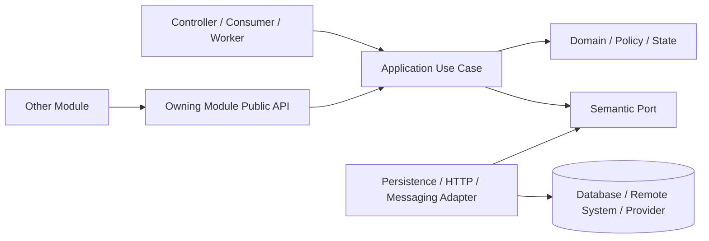

# 架构模式选择与功能块实现规范

> 文档状态：已生效，强制评审  
> 适用范围：后端应用、模块和分布式系统边界  

## 1. 核心原则

架构模式按问题组合使用，不要求一个系统只选择一种模式。采用项目必须在自己的架构文档或 Profile 中声明物理部署、模块边界、数据所有权和通信方式；通用规范只给出选择条件。

选择时从满足需求的最简单结构开始：

1. 简单用例使用分层职责；
2. 复杂业务规则使用领域模型和清洁依赖方向；
3. 外部系统使用端口与适配器；
4. 需要时间解耦或失败恢复时使用事件/持久化任务；
5. 只有独立扩缩、故障域、数据所有权或团队自治已有证据时才拆分服务。

架构必须服务于可维护性、正确性和运行目标，不能以模式数量、目录层数或服务数量衡量成熟度。

## 2. 通用依赖方向

- 外层依赖内层稳定契约，内层不能依赖外层框架或供应商细节。
- Port 由需要隔离的用例拥有，Adapter 在基础设施层实现；没有隔离价值时直接使用具体类型。
- 跨模块只访问拥有模块的公开面，不能绕过到持久化或内部实现。
- 依赖图必须无循环；不能用全局工具、事件总线或反射掩盖循环。

## 3. 架构模式的适用边界

### 3.1 分层架构

适合规则简单的 CRUD、目录查询和后台管理。典型职责为 Controller → Application Service → Persistence Adapter。分层不要求每层都有接口、DTO 和 Mapper；简单路径可以少类型，但入口层不决定业务规则，持久化层不编排用例。

### 3.2 六边形架构

适合存在数据库、消息系统、支付、身份、邮件、对象存储或其他外部依赖的功能。核心用例依赖语义 Port，协议、SDK、供应商错误和 Secret 由 Adapter 隔离。只有一个实现时，Port 仍必须有真实边界价值。

### 3.3 清洁架构

适合业务规则复杂、生命周期长且需要脱离框架测试的模块。实体/值对象和领域规则在内层，用例在应用层，Web、数据库和供应商是外层细节。不要求机械使用特定目录名；关键是依赖只能指向更稳定的规则。

### 3.4 模块化单体

适合业务边界逐步形成、需要单一部署和本地事务的系统。模块必须有明确公开面和数据所有权，并通过编译/架构测试阻止内部依赖。模块化单体不是“所有代码互相可见”的普通单体，也不等于以后必须拆成微服务。

### 3.5 事件驱动架构

只在时间解耦、扇出或失败恢复确实需要时使用：

- 同进程且允许随事务回滚：进程内领域事件；
- 提交后必须执行：持久化 Operation/Outbox；
- 外部至少一次投递：Outbox/Delivery + Consumer Inbox；
- 同一事务中的金额、库存、配额、授权或状态强不变量不能仅靠异步事件维护。

事件必须有稳定身份、版本、幂等、顺序假设、重试上限和死信/人工恢复路径。不要承诺 Exactly Once。

### 3.6 微服务架构

只有出现以下一项或多项证据时才评估拆分：

- 某运行面资源需求与其他功能显著不同；
- 故障必须隔离，且单体内限流/舱壁不足；
- 团队能够独立拥有数据、发布、值班和兼容契约；
- 单体边界已稳定，跨边界事务可以明确处理；
- 拆分收益通过 SLO、吞吐、成本或交付数据量化。

拆分前先明确数据所有权、契约、迁移和回退。禁止多个服务共享写数据库，或先复制数据访问再补边界。

### 3.7 CQRS

当写模型不变量复杂，而查询形态、性能或生命周期明显不同，可以在同一模块分离 Command 与 Query 类型。没有独立扩展和一致性需求时，不引入独立总线、数据库或框架；“读写方法分开”已经可以满足多数场景。

## 4. 按大功能块选择实现方式

| 功能块 | 默认实现 | 关键约束 | 常见误用 |
|---|---|---|---|
| 登录与会话 | 安全框架 + 服务端/标准协议会话 | Token/凭据保护、CSRF、可信 Principal | 自定义加密协议、长期 Token 暴露给不可信端 |
| 普通 CRUD | 分层 Controller → Application → Persistence | 输入校验、事务、稳定错误、分页上限 | 万能 CRUD/BaseService |
| 组合搜索与列表 | Query 用例 + 数据库动态条件/游标 | 条件白名单、稳定排序、数据库过滤 | 全表加载后内存过滤 |
| 状态机 | Domain Policy + Application 事务 + 条件更新 | 合法转换集中、并发版本、审计 | Controller `if` 链、状态字符串散落 |
| 授权与隔离 | 可信身份 + Policy + 持久化约束 | 默认拒绝、资源归属、负向测试 | 信任请求中的租户/角色字段 |
| 账本与金额 | 不可变事实 + Policy + 对账/Outbox | 精确金额、币种、幂等、结果未知 | 浮点金额、缓存余额作为权威事实 |
| 外部供应商调用 | Port/Adapter，事务外调用 | timeout、并发、重试、错误转换、Secret 边界 | Controller 直调 SDK、事务内网络调用 |
| 长流程与升级 | 持久化 Operation + Worker + 版本化契约 | 租约、重试、幂等、恢复 | 请求线程长事务、只在内存保存进度 |
| 通知与渠道投递 | Notification 事实 + Delivery + Channel Adapter | 收件目标、偏好、模板、加密、重试 | 业务事务内直接调用渠道 |
| 跨系统同步 API | 版本化契约 + Adapter/Proxy + 授权绑定 | 身份、范围、目标解析、超时 | 调用方指定任意目标 URL、共享数据库 |
| 跨系统事件 | 版本化事件 + Outbox/Inbox/Delivery | 至少一次、签名、去重、重放 | Exactly Once 假设、无版本事件 |
| 第三方接入审核 | 校验 + 沙箱 + 审核状态机 + 固定摘要 | 职责分离、不执行不可信代码、审计 | 动态加载上传代码、审核原地覆盖 |
| 定时与批处理 | 持久化任务表/队列 + lease | 批次上限、短事务、可恢复 | 无界线程、仅内存队列 |

## 5. 模块内部选择

### 5.1 简单功能

单表或少量 Join、规则只有校验/授权、没有复杂状态或外部依赖时，使用最小分层即可，不强行建立 Domain、Port、Factory 或 Mapper。

### 5.2 复杂领域功能

出现多状态非法边、金额/配额不变量、并发竞态、多个入口共享规则或需要脱离框架测试时，引入值对象、Domain Policy 和集中状态转换。

### 5.3 外部集成功能

协议、Secret、供应商 DTO、错误和重试留在 Adapter。需要可靠执行时先持久化 Operation/Outbox，提交后调用，结果在新事务登记。第二个真实实现出现前不预建 Registry。

### 5.4 查询功能

查询与写模型可以使用不同 Application/Persistence 类型，但不提前引入独立 CQRS 基础设施。过滤、排序、聚合和分页尽量由数据源完成，返回专用 View。

## 6. 架构升级决策

以下变化必须先更新采用项目的架构文档，长期影响需要 ADR：

- 新增部署单元、数据库、消息系统、缓存、网关或对象存储；
- 改变模块或数据的拥有者；
- 从同步强一致改为异步最终一致；
- 引入全局 Port、Registry、插件机制或 Workflow Engine；
- 改变外部契约、身份协议、事件或数据库兼容策略；
- 启用新的并发模型、AOT、非默认运行时或全局缓存。

决策至少记录问题、备选方案、证据、影响、迁移、Owner、可观测指标和回退。

## 7. 评审清单

- [ ] 功能按真实复杂度选择最小架构，没有全系统机械套一种模式。
- [ ] 入口、应用、领域和基础设施职责与依赖方向清楚。
- [ ] 简单功能没有空接口/空包，复杂规则没有堆在入口或持久化层。
- [ ] 外部调用位于事务外，可靠副作用有持久化事实和恢复路径。
- [ ] 强一致规则没有被错误事件化，消费者具备幂等和至少一次语义。
- [ ] 身份、隔离、数据所有权和跨模块公开面没有绕过。
- [ ] 新基础设施或服务拆分有量化证据、Owner、迁移和回退方案。
